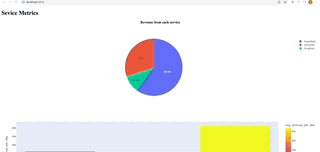
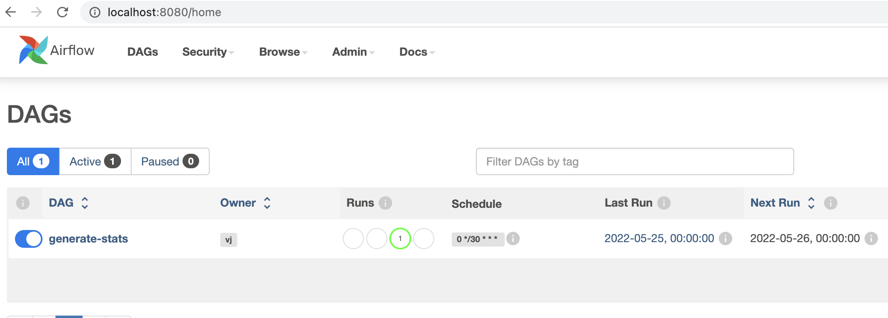
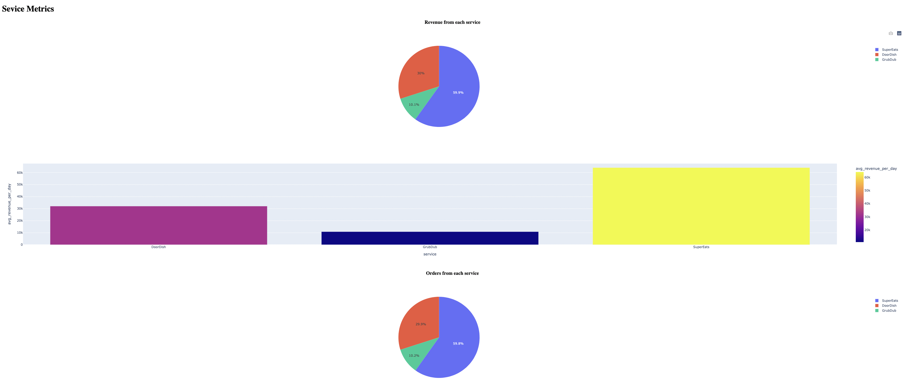
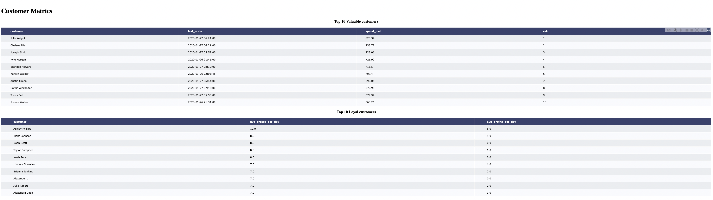
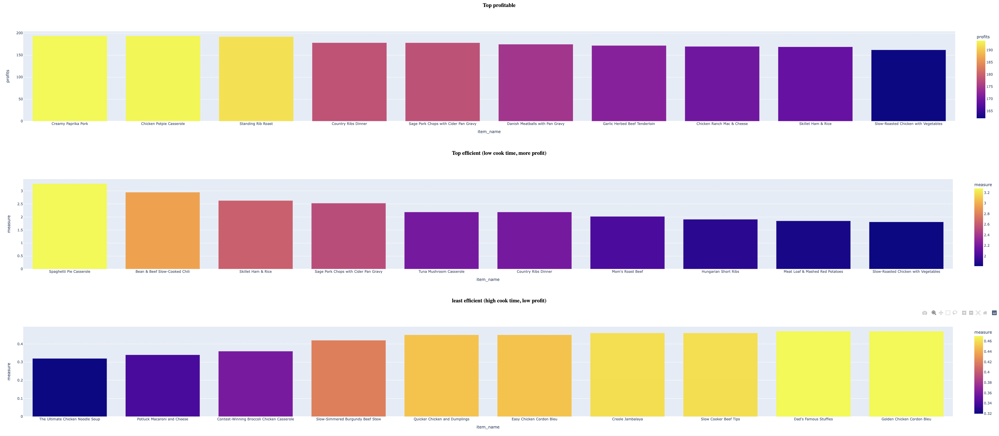
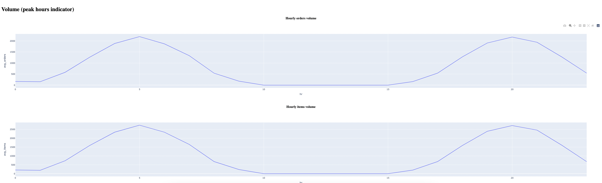

# Insight into McRonald's orders

## Tl;DR (Quick View)

### Start the docker container

> `docker compose up -d`

Note: may take few minutes, as services built and stood up in sequence as some of them depend on others.

### Visit webpage

> `http://localhost:5010/`

This should display an interactive (but basic) dashboard build using plotly, which includes

- `customer metrics`: shows valuable customer, loyal customers insights
- `item metrics`: shows profitable, cost effiective items
- `service metrics`: shows orders, profits from each service
- `volume metrics`: shows peak hours of orders

Here is how it will look like:



## Details

The Project is for generate insights into McRonald's orders. For ease of  maintenance the project broken down into multiple services

```
$ tree mcRonalds/ -L 1 -d
mcRonalds/
├── aggregator
├── db
├── insighter
├── items
└── orders
```

### **db**

Mysql/MariaDB Databse instance where all the raw and aggregated data save. Used by `items`, `orders` and `insighter` services to read and write from the db.

```
MariaDB [css]> show tables;
+----------------+
| Tables_in_css  |
+----------------+
| items          |
| order_items    |
| orders         |
| orders_summary |
+----------------+
4 rows in set (0.002 sec)
```

see [scratchpad.sql](scratchpad.sql) for additional exploratory queries.

### **items**

Is a service that handles items, loads the raw json items data into `db`.

**url**: [localhost:5011](http://localhost:5011)
> **Note** The endpoint/url is just placeholder

### **orders**

Is a service that handles orders, loads the raw json orders and order_items data into db.

**url**: [localhost:5012](http://localhost:5012)
> **Note** The endpoint/url is just placeholder

### **insighter**

Is the web service that displays the dashboard using raw data added by items and orders services. Uses Flask + Dash to display the charts direct to the webpage.

**url**: [localhost:5012](http://localhost:5010)

### **aggregator**

Is an ETL pipeline, as the name indicates it's primary responsiblity is to generate summary tables from raw data. Aggregator using airflow to run the ETL.

Has only one DAG (`generate-stats`) that generates order summary from items and orders data.



> **Note:** The DAG currently has issues due to a [bug in airflow](https://github.com/apache/airflow/discussions/23508) that prevent adding packages to _PIP_ADDITIONAL_REQUIREMENTS in the docker compose. Did spend time to figure out a workaround, it seemed like a rabbithole so avoided speding more time on it.

**url**: [localhost:8080](http://localhost:8080)
**username**: `airflow`
**pwd**: `airflow`

## Insights from dashborad

Here are some insight generated from the dashboard

### Service level insights



- More than 50% of our orders originate from **SuperEats**
- Daily customers from **SuperEats** are more that other services

### Customer level insights



- **Julie** seem to be most valuable customer
- **Ashley** seem to be loyal customer (has more order per week, on average)

### Item level insights



- **Creamy Paprika Pork** is most profitable item, i.e sells more than any other ones
- **Spaghetti Pie Casserole** is most cost efficient item, i.e more profits with smaller amount of time
- **The Ultimate Chicken Noodle Soup** is least cost efficient item, i.e takes longer to make but result in less profits

### Volume level insights



- Our order tends to peak around 0500 hours and 2000 hours

## Resutarunt parallelism

In order to determine restaurant's ablity to make items parallelly I believe following basic information is necessary

- Number of Cheifs
- Number of Kitchens (assuming all the kitchen unit is fixed size and identitcal)
- Max allowed wait time (from the order time)

These can be dynamic input from UI, by inputing we can caculate the max N where orders won't be cancelled, specailly ones with high profit

## Next steps (Things I couldn't get to)

Here are some fo the things I would like to do if I were to continue working on this project:

### **1.Fixing airflow**
  
  As metioned above, DAGs in aggregate are not fully functionaly due to a [bug in airflow](https://github.com/apache/airflow/discussions/23508). I would like to apply the fix or work on a workaround to make the DAGs working. Did found some potential fixes, but they did seem to work.

  To have a cleaner and proper sepration, using a dedicated postrges DB for airflow instance. Going forward I would like to look into have airflow use the same mysql instance as the data, which may help with displaying metadata in future dashboards.

### **2.Switching to ORM**

  Items and Orders are simple python logic the reads json and writes to database, I would like to switch this to ORM based logic. Instead of sql queries I wanted to read and write using objects. Initally was planning on using airflow, but since airflow was not working as I expected, had to switch to this approach.

### **3.Impelementing Resutarunt parallelism**
